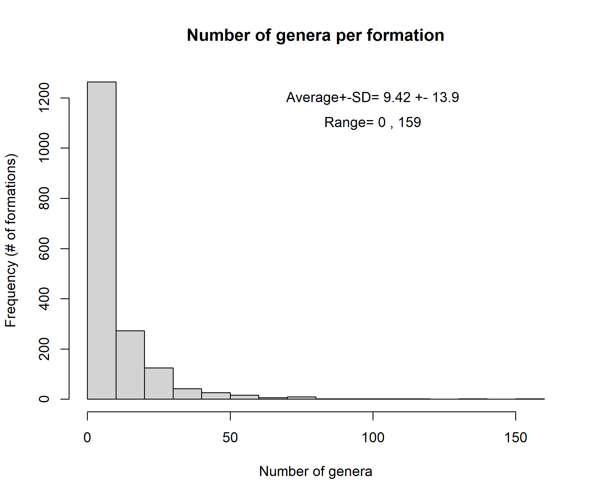
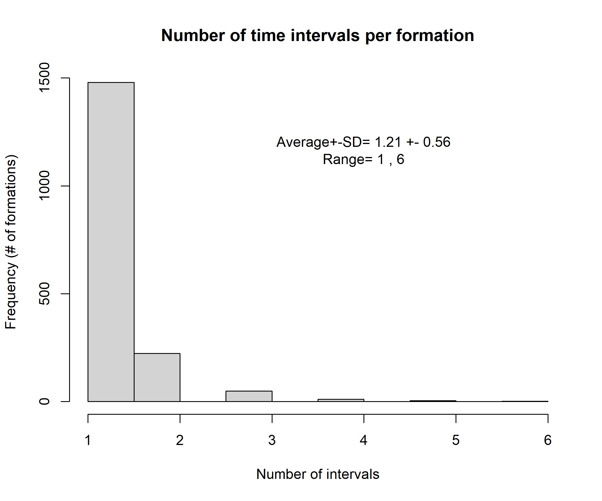
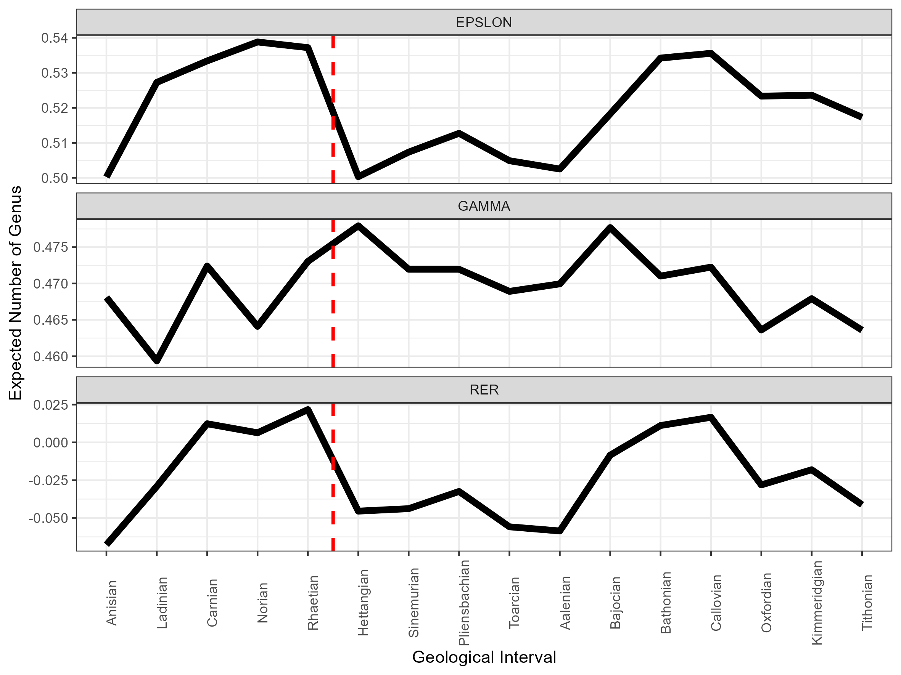
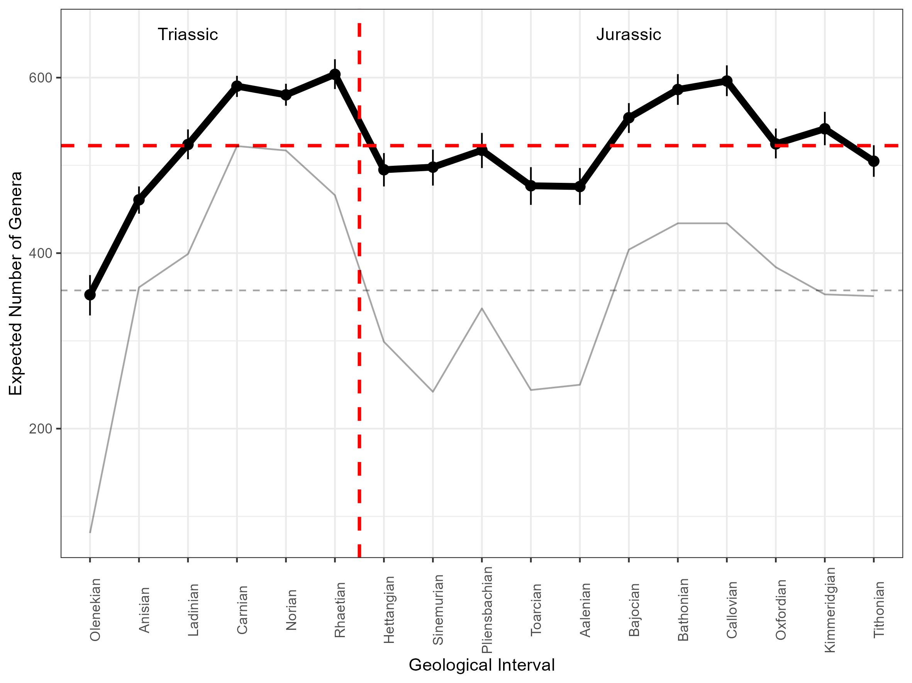
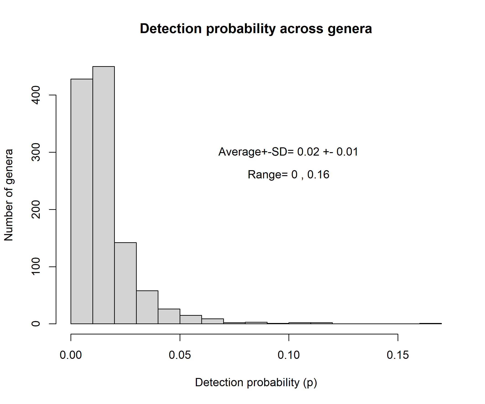
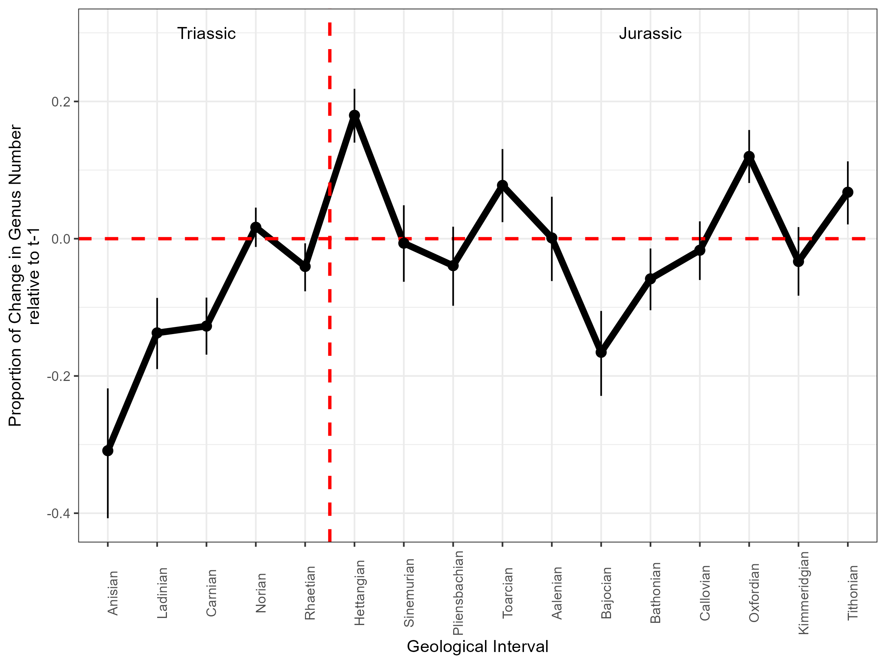
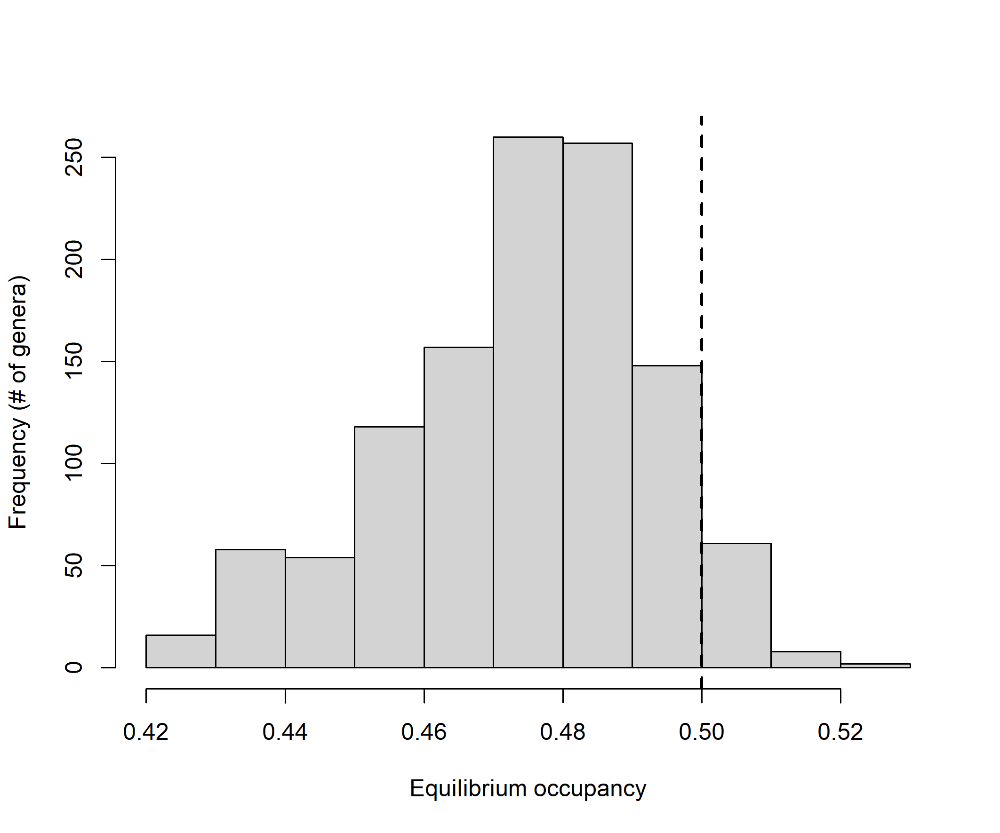
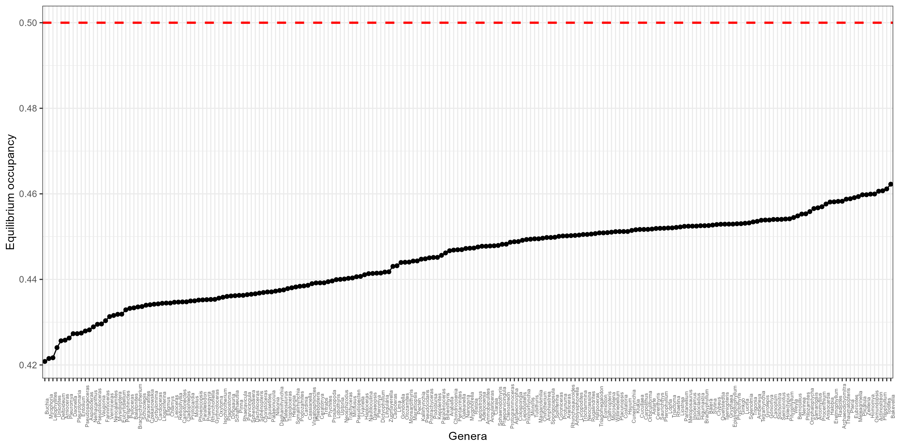

<!-- README.md is generated from README.Rmd. Please edit that file -->

<!-- badges: start -->
<!-- badges: end -->

```{r setup, include=FALSE}
knitr::opts_chunk$set(echo = TRUE)
```


# 1. Introduction

#### A bit about diversification and the fossil record
Extinctions are large depressions on Earth biodiversity history (Benton 1995). The diversity of all organisms on Earth, with an likely origin during the Precambrian period (4560 to 570 Ma), has increased rapidly and substantially after the Vendian and Early Cambrian (600 Ma) (Benton 1995). Since then, periods of diversification (i.e. the balance of extinctions and speciations/originations) were marked by periods of high rates of origination interrupted/interpassed by periods of biodiversity crisis/depression, called 'mass extinctions' (Benton 1995). The fossil record supports five mass extinction events, known as the 'big five': end Permian, late Ordovician, late Devonian, Triassic-Jurassic boundary, and Cretaceous-Paleogene boundary -- that  vanished from Earth a considerable proportion of biodiversity, while speciation and radiation to vacant niches occurred for remaining genera from there on (Benton 1995, May 1997, Reeves et al. 2020).
  
The Triassic-Jurassic extinction (Rhaetian-Hettangian intervals) played an important role in the diversification rates of archosaurs, therapsid reptiles, ammonites, among others (Allen et al. 2018), yet recent research cast doubt on their existence (Bambach et al. 2004). The statistical support for this extinction event (and its place as one of the 'big five' extinctions) is limited due to the generally small sample size at the Rhaetian-Hettangian intervals. Existing evidence suggests that the lower number of genera at this period can be a byproduct of high extinction rates (e.g., Wignall & Atkinson 2020; Olsen et al. 2022) --which seemed to exert an impressive effect on marine organisms (Benton 1995)-- as well the low origination/speciation rates and nearly constant extinction rates compared to previous time (Bamchach et al. 2004). Thus, models that account for both uneven sampling size across periods and the state of genera occurrence at previous time could provide a more robust inference on/shed light on the processes that caused the Triassic-Jurassic extinction, whether low speciation/low extinction rates or high extinction/low speciation rates.
    
#### The drivers of distribution
Understanding what drives shifts in temporal and spatial distribution of genera is one of the major goals in biology, disregarding whether the studied genera are extinct or extant. In the case of extinct genera, the abiotic environment and its variation over millennia years might affect extinction and origination rates (e.g., Fritz et al. 2013), while factors that hamper data collection and the taphonomic process (e.g., sedimentation, transport) might bias species detection in fossilized samples (Liow 2013). The simultaneous accounting of ecological and sampling processes yielding modeled data in hierarchical models has some tradition in ecology (Williams et al. 2002, McKenzie et al. 2002, Kery et al. 2013, Guillera-Arroita et al. 2016; reviewed by Kellner & Swihart 2014) but the use of these models to make inference in paleontology is still in its infancy (Liow 2013, Lawing et al. 2021). Accounting for these drivers of distribution might provide better maps, more robust inferences and treatment of biological and observational uncertainty producing paleontological data (Liow 2013 for a paleontological perspective; Kery et al. 2013, Guillera-Arroita et al. 2016 show ecological (neontological) perspectives).
    
#### Major aim
Here we used ~2 million fossil observations comprising 1139 genera and 1770 geologic formations, collected across the entire Triassic-Jurassic periods, to estimate pairwise rates of extinction and origination across 17 time intervals of the Triassic and Jurassic periods (Olenekian (early Triassic) to Tithonian (late Jurassic)). We emphasized i) temporal variation on these rates, ii) the proportional change in number of genus from the beggining of each interval to its end (Bambach et al., 2004), and iii) the expected number of genera across these intervals. As the limit between the Rhaetian (age) and Hettangian (age) marked the Triassic-Jurassic extinction event and the split between these periods, we expected to find i) higher rates of extinction and lower rates of origination, ii) high change in the number of genus from the beggining to the end of these periods, and iii) a lower expected number of genera at Rhaetian-Hettangian intervals when compared to other intervals in the data. We summarized the trends in genus occurrence over time using classic paleontological indicators, such as the proportion of change (gains or losses) (Bambach et al. 2004), relative extinction rate (Barnosky 2018), and indicators often used in population ecology, such as Equilibrium Occupancy and the expected number of taxa given the model structure (Kéry & Royle 2007; Kéry & Royle 2021), and indicators used in both disciplines, namely extinction and origination probabilities (Kéry & Royle 2007; Benton 1995).   

<!-- badges: start -->
<!-- badges: end -->

# Methods
We used the Paleo Database (REF) as the main source of paleontological data for the Triassic-Jurassic period. We used information at the genus level, as genera give a closer view of species-level behavior through time, despite comprising less complete data than one at a higher taxonomic level because of the vagaries of preservation, collection, and study (Benton 1995). Nonetheless, we accounted for such sampling biases in our models.

## State-space models

State-space models are hierarchical models that enable the estimation of biological parameters describing dynamic properties of ecological systems (Kéry & Royle 2007, Ecology). They are called 'first-order Markovian models' because they use information from previous time and/or neighbor sites to project biological parameters in the next time. Thus, they are useful to estimating parameters involved with inference in paleontology, such as genus extinction (*epslon*), origination (*gamma*), and turnover rates (Bambach et al. 2004, Benton 1995). In state-space models, the true state of a system (e.g. the realized occurrence of the fossil genera *g* at the time interval *t*) is denoted by the latent, stochastic variable *z[t,g]*.  The *z[t,g]* is the realization of a Bernoulli process ('dbern') dependent on the variable *muZ[t,g]*, which is the expected probability of occupancy of interval *t* by the genus *g*. In its turn, the *muZ[t,g]* depends on both the realized occurrence of genus *g* in the previous time *t-1*, ie. *z[t-1,g]* (whose first time gives the initial conditions for the dynamics develop) and the estimated probability of genus extinction (*epslon[t]* = 1 - *phi[t]*) and origination (*gamma[t]*) in the next interval if the previous interval *t-1* is either occupied or not by the genus *g*. We nonetheless acknowledge that  origination rates actually can be both origination *per se* --when a new genus arise-- and colonization --when an existing genus appear in an interval. However, at the millennial timescale colonization rates are expected to be low and perhaps constant over time (REF).
The model design looks like:


```{r comment='', echo = F}
cat(readLines('dyn_model_vectorized.txt'), sep = '\n')
``` 


Besides allowing the estimation of biological parameters depicting taxon dynamics over time, state-space models enable the estimation of parameters depicting the probability of detecting a genus *p[g]* in any geological formation and interval conditional on the genus realized occurrence *z[t,g]*. The new detection/detection dataset (or the data that should be observed given the realization of the biological and observational processes) of genus *g* in interval *t* and geological formation *k*, denoted by the latent variable *y[g,t,k]*, is another parameter estimated by the state-space model. The  *y[g,t,k]* is the realization of a Bernoulli process which depends on *muY[g,t,k]*, i.e. the probability of detecting a genus conditional on its realized occurrence (i.e., *z[t,g] x p[g]*). In this model, *p[g]* only varies across genera. We estimated genus detection probability across geological formations as each one of them represent a fieldwork effort to obtain fossil data, and might represent differential physical processes causing sedimentation/erosion, transport, deformation, and lost of paleontological/taphonomic information/affect fosssil preservation.
The input data consist of detections and non-detections (coded as 1 and 0, respectively) of each genus in each geological formation and interval. A genus was 'detected' if it appeared at least once in a geological formation and interval, and it was 'not-detected' if it not appeared in formations and intervals with at least one detected genus. Missing observations (coded as 'NA') comprise intervals and formations with no detected genus, and were removed from the state-space model. Nonetheless, the model estimated data for these missing observations using the existing data and the prior information (see below "Modeling approach").

## Derived parameters
Using the state-space model structure we were able to estimate parameters often used to make inference in paleontology, namely 'extinction probability', 'origination probability', 'relative extinction rates','expected number of genera','proportional change', and 'equilibrium occupancy'. 

The first two  depict the probability of genus extinction and origination from t to t+1 (i.e., between each pair of adjacent time intervals). There were 16 probability estimates from Olenekian (early Triassic) to Tithonian (late Jurassic), as there is no transition from Olenekian to the previous time (Changhsingiano, late Permian). We choose not to include Permian data in our state-space model because it would introduce a large taxonomic heterogeneity in our data, as the Permian-Triassic boundary (~252 Ma) was characterized by the most massive extinction on Earth's history (Benton 1995).

The relative extinction rate (Barnosky 2018) defines the intervals when the magnitude of extinction was higher, equal, or lower than origination, and was calculated as follows:

*RER[t]* = (1-phi[t])/gamma[t]


The 'expected number of genera' depicts the expected number of genera given the extinction and origination probabilities. It is basically the sum of the rows of the matrix *z[t,g]* (the realized occurrence data). We compared the estimated and observed number of genera to show the effect of accounting for imperfect detection on model estimates. The observed number of genera (i.e., the number of genera in the model input data) naively assume perfect detection (i.e. *p=1*) of genera across the geological formations and intervals. In other words, the naïve estimate assumes that taphonomic processes were equal across geological formations and intervals, which might not be true given the large spans of time and climatic and geological variation through the Triassic and Jurassic (detection biases in fossil record are discussed in Liow, 2013).

The proportional change (PCh) (Bambach et al. 2004) depicts the difference in the number of genera in the end relative to the beginning of a given period, as follows:

*PCh[t]* = sum (z[t-1,]) - sum(z[t,]))/sum(z[t-1,])

The equilibrium occupancy showing the trend of a genus *g* to either decline or increase over time was estimated as follows:

*psi.eq[g]* = mean(gamma[t:T,g])/(mean(gamma[t:T,g])+mean(1-phi[t:T,g]))

Thus, turnover rate might be rapid for genera presenting negative *psi.eq*, whereas genera  with persistent occurrence over time intervals should present positive *psi.eq*. We estimated the posterior exceedance probability to find the genera showing consistent trend in the *psi.eq[g]* over time intervals. The posterior exceedance probability of *psi.eq* of each genus refers to the proportion of posterior probability samples higher or lower than *psi.eq*=0.5, the zone of no change in occupancy. Here, we considered that a genus presenting a posterior exceedance probability > 0.8 showed a consistent trend of either increasing or decreasing occupancy over time. 

## Modeling approach

We estimated the state-space model parameters using Bayesian inference. Bayesian inference is a statistical method that applies the Bayes Theorem to update prior information about parameter values with observed data to then estimate the posterior parameter probability. The prior information, generally represented by statistical distributions (such as the Uniform one), are updated by their integration with data and likelihood estimation across independent Monte Carlo Markov Chains (MCMC). Variation in parameter estimates across posterior distribution samples represents an appropriate measure of parameter uncertainty (Kruschke & Liddell, 2018). The Credible Intervals (CI), built using the quantiles of the posterior distribution samples of each parameter, depict the interval where most posterior distribution samples are and, therefore, delimit the area in which we have large certainty of finding the true parameter value (Kruschke & Liddell, 2018).

The priors for all model parameters were assumed to come from an Uniform distribution ranging from 0 to 1 (*phi[t,g]*, *gamma[t,g]*, *psi[t=1,g]*, *p[g]* ~ U(0,1)).

Our state-space model was run using three independent MCMC (using the Gibbs Sampling algorithm implemented in JAGS; Plummer, 2003), with 15,000 iterations and a warm up period of 7,000 iterations each chain. We retained 1000 post-warm up samples of each chain, resulting in 3000 posterior distribution samples of each model parameter which were used to make statistical inference and test our hypotheses.

<!-- badges: start -->
<!-- badges: end -->

# Results
The analyzed dataset comprises 1139 genera observed at 17 time intervals and 1769 geological formations. Thus, if all intervals and geological formations were sampled we would have 30.073 possible observations per taxon/genus with this dataset. However, the dataset is quite sparse, with many missing observations: it has only 7.1 % (n=2.149 observations) out of the possible observations per taxon. Most of geological formations had less than 10 genera each, with an average of 9.42+-13.9 genera per formation (Fig. 1). Most formations covered just one time interval, covering an average of 1.21 +- 0.56 intervals and no more than six time intervals (Fig. 2). Also, time intervals were covered by 75 to 229 geological formations (average of 126.41.41 +- 43.72) showing the variation in sampling effort and data availability across the Tr-J intervals, justifying the use of the state-space model to account for  imperfect detection of genera across geological formations and intervals.


```{r echo=FALSE, out.width = "100%",out.height = "80%", fig.align = "center"}

```
*Fig. 1. Number of genera (genera) per geological formation.*

```{r echo=FALSE, out.width = "100%",out.height = "80%", fig.align = "center"}

```
*Fig. 2. Number of time intervals per geological formation.*

```{r echo=FALSE, out.width = "100%",out.height = "80%", fig.align = "center"}

```
Fig. 3. Number of geological formations per time interval.

<!-- badges: start -->
<!-- badges: end -->


We found that extinction rates (*epslon*) were higher (~0.54) at the interval between the Carnian and Norian, between the Norian and Rhaetian, and dropped to ~0.5 between Rhaetian and Hettangian (Tr-J boundary; Fig. 4). We also detected high extinction rates between the Bathonian and Callovian intervals, during the Jurassic. In their turn, the origination rates (*gamma*) were higher between Rhaetian and Hettangian (Tr-J boundary), and between Bajocian and Bathonian (Jurassic) (Fig. 4). The relative extinction rates (*RER*) shows that extinction exceeded origination (RER>0) between the Norian and Rhaetian, Callovian and Bathonian, and Ladinian and Carnian. In contrast, origination exceeded extinction (RER <0) for most Jurrasic (except between Callovian and Bathonian) (Fig. 4).

```{r echo=FALSE, out.width = "100%",out.height = "80%", fig.align = "center"}

```
*Fig. 4. Extinction (EPSLON), origination (GAMMA), and relative extinction rates (RER) across the 17 intervals comprising the Triassic-Jurassic geological periods. The vertical red-dashed line depict the Triassic-Jurassic extinction event.*


The dynamics of these extinction and origination rates resulted in a expected number of genera that peaked at ~600 genera at the Rhaetian (Tr) and Callovian (J) intervals (Fig. 5). The lower expected number of genera was found in the starting interval, the Olenekian, which had an expected number of ~350 genera. This might be an effect of the largest extinction event observed in Earth the Permian–Triassic extinction event [even though the model was not informed about this event]. The state-space model estimated a number of ~500 genera in the Hettangian, the interval that started after the Triassic-Jurassic extinction event, representing a reduction of ~100 genera relative to the previous interval Rhaetian in the late Triassic (Fig. 5). The expected number of genera was almost constant from early (Hettangian) to Aalenian intervals (start of middle Jurassic), showing an increase from Aalenian throughout the middle Jurassic (ended in Callovian), and a decrease to up ~600-610 genera during the late Jurassic (Oxfordian onwards). Finally, the expected number of genera was always higher than the observed (naïve) number of genera. Indeed, the detection probability was always lower than 1 (Fig. 6), implying that some genera were declared absent/were not detected in truly occupied formations and intervals.


```{r echo=FALSE, out.width = "100%",out.height = "80%", fig.align = "center"}

```
*Fig. 5. Number of genera across the 17 intervals comprising the Triassic-Jurassic geological periods. The thick line depicts the expected number of genera produced by the state-space model, and the horizontal red line depicts the average expected number of genera across intervals. The thin line represent the observed (naïve) number of genera across intervals, and the gray thin horizontal line depicted the average observed number of genera. The error bars around the expected number of genera is the 95% Credible Interval across the 3.000 posterior distribution samples of this derived parameter. The vertical red-dashed line depict the Triassic-Jurassic extinction event.*


```{r echo=FALSE, out.width = "100%",out.height = "80%", fig.align = "center"}

```
*Fig. 6. Detection probability across genera. Plotted values and summary statistics are the averages for each genera across the 3.000 posterior distribution samples of this the detection probability.*

The proportion of change, depicting the difference in the expected number of genera between the start and the end of each interval, showed that the highest gain of genera (positive values) was found within the Hettangian interval, soon after the Triassic-Jurassic extinction event (Fig. 7). The gain was also larger than zero within the Toarcian, Oxfordian, and Tithonian intervals. Almost no change was detected at the Norian (Jurassic), Sinemurian, Aalenian, and Callovian (Jurassic, Fig. 7). Losses were detected before the Norian (Anisian, Ladinian, Carnian, and Rhaetian) (Triassic), and within Bajocian and Bathonian (Jurassic).

```{r echo=FALSE, out.width = "100%",out.height = "80%", fig.align = "center"}

```
*Fig. 7. The proportional change in the expected number of genera between the start and the end of each time interval. The vertical red-dashed line depict the Triassic-Jurassic extinction event. The error bars around the plotted values are 95% Credible Interval across the 3.000 posterior distribution samples of this derived parameter.*

Finally, the Equilibrium occupancy, showing the trend of the genera to either decline or increase in occupancy over time over time (if *psi.eq* is > or < than 0.5, respectively), showed that 94% (n=1068) of the genera had the trend to decline in occupancy over time (i.e. *psi.eq < 0.5*), and only 6% (n=71) had the trend to increase in occupancy over time (Fig. 8). However, posterior exceedance probability showed that only the decreasing occupancy trend was consistent across taxa, with 210 out of 1139 genera presenting a decreasing trend and none presenting an increasing trend (Fig. 9). The three genera with most negative *psi.eq* were: the shellfish *Buchia* and *Myophoria*, and the ammonite *Leiophyllites* (Fig. 9).

```{r echo=FALSE, out.width = "100%",out.height = "80%", fig.align = "center"}

```
*Fig. 8. Histogram of equilibrium occupancy across genera. Plotted values are the averages of psi.eq for each genera across the 3.000 posterior distribution samples of this parameter. The vertical black-dashed line depicts the point of no change in occupancy over time (psi.eq=0.5) *


```{r echo=FALSE, out.width = "100%",out.height = "80%", fig.align = "center"}

```
*Fig. 9: Equilibrium occupancy across the genera with posterior exceedance probability>0.8 across posterior distribution samples of  psi.eq. Plotted values are the averages of psi.eq for each genera across the 3.000 posterior distribution samples of this parameter. The horizontal red-dashed line runs over 0.5, the region lacking a trend in occupancy.*


<!-- badges: start -->
<!-- badges: end -->


# Discussion

We found that the depression in the number of genera found in Tr-J boundary was a byproduct of high extinction rates during the Rhaetian and the intervals preceding it (Norian and Carnian), when extinction rates surpassed the origination rates (as shown by the relative extinction rates, *RER[t]*. 

Psi.eq showed the taxa with higher turnover rates over time. An amount of 18% (n=210 out of 1139) of the studied genera showed a consistent trend of declines over time, which can be useful as index fossils to characterizing different ecological communities and dating rocks.
 

#### This paper was produced using the following software and associated packages:

```{r pressure, echo=F,warning=F,message=F}

source("R/packages.R")
sessionInfo()


```