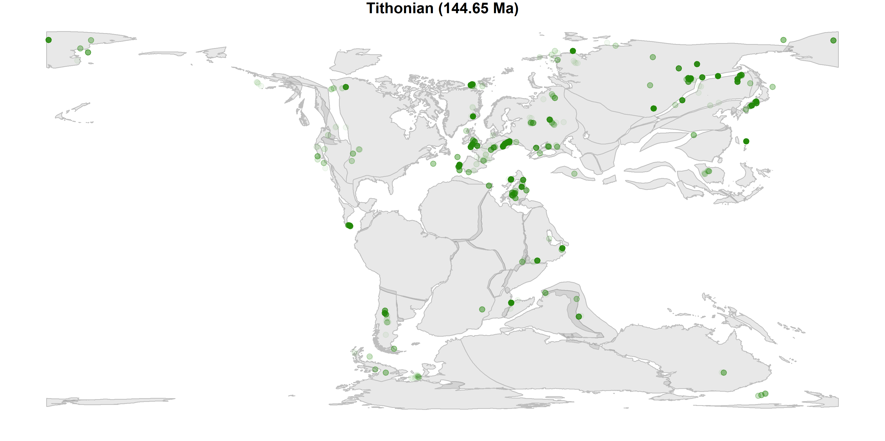

Spatiotemporal dynamics of Cynodontia through end-Paleozoic and Mesozoic
eras
================
ALLuza, MG Bender, CS Dambros, F Pretto, L Kerber - Departamento de
Ecologia e Evolução, Universidade Federal de Santa Maria
2023-07-03

<!-- README.md is generated from README.Rmd. Please edit that file -->
<!-- badges: start -->
<!-- badges: end -->

Spatiotemporal distribution and dynamics of Cynodontia.

*Animation: data distribution over space and time. Might have a mismatch
between records and land position because land position was defined at
the middle of each stage. Paleontological map model: Golonka model*

#### This paper was produced using the following software and associated packages:

    ## R version 4.3.0 (2023-04-21 ucrt)
    ## Platform: x86_64-w64-mingw32/x64 (64-bit)
    ## Running under: Windows 10 x64 (build 19045)
    ## 
    ## Matrix products: default
    ## 
    ## 
    ## locale:
    ## [1] LC_COLLATE=Portuguese_Brazil.utf8  LC_CTYPE=Portuguese_Brazil.utf8   
    ## [3] LC_MONETARY=Portuguese_Brazil.utf8 LC_NUMERIC=C                      
    ## [5] LC_TIME=Portuguese_Brazil.utf8    
    ## 
    ## time zone: America/Sao_Paulo
    ## tzcode source: internal
    ## 
    ## attached base packages:
    ## [1] stats     graphics  grDevices utils     datasets  methods   base     
    ## 
    ## other attached packages:
    ##  [1] sf_1.0-12         mapast_0.1        ncdf4_1.21        R2WinBUGS_2.1-21 
    ##  [5] boot_1.3-28.1     coda_0.19-4       jagsUI_1.5.2      deeptime_1.0.1   
    ##  [9] palaeoverse_1.2.0 lubridate_1.9.2   forcats_1.0.0     stringr_1.5.0    
    ## [13] readr_2.1.4       tidyr_1.3.0       tibble_3.2.1      tidyverse_2.0.0  
    ## [17] kableExtra_1.3.4  knitr_1.42        janitor_2.2.0     purrr_1.0.1      
    ## [21] reshape_0.8.9     magick_2.7.4      dplyr_1.1.2       viridis_0.6.3    
    ## [25] viridisLite_0.4.2 rasterVis_0.51.5  lattice_0.21-8    gridExtra_2.3    
    ## [29] ggplot2_3.4.2     openxlsx_4.2.5.2  raster_3.6-20     rgdal_1.6-6      
    ## [33] rgeos_0.6-2       sp_1.6-0          here_1.0.1       
    ## 
    ## loaded via a namespace (and not attached):
    ##   [1] splines_4.3.0           later_1.3.1             bitops_1.0-7           
    ##   [4] polyclip_1.10-4         lifecycle_1.0.3         doParallel_1.0.17      
    ##   [7] rprojroot_2.0.3         processx_3.8.1          MASS_7.3-58.4          
    ##  [10] magrittr_2.0.3          rmarkdown_2.21          yaml_2.3.7             
    ##  [13] remotes_2.4.2           plotrix_3.8-2           httpuv_1.6.10          
    ##  [16] zip_2.3.0               sessioninfo_1.2.2       pkgbuild_1.4.0         
    ##  [19] pbapply_1.7-0           DBI_1.1.3               RColorBrewer_1.1-3     
    ##  [22] maps_3.4.1              pkgload_1.3.2           rvest_1.0.3            
    ##  [25] expm_0.999-7            quadprog_1.5-8          RCurl_1.98-1.12        
    ##  [28] tweenr_2.0.2            terra_1.7-29            vegan_2.6-4            
    ##  [31] units_0.8-2             permute_0.9-7           svglite_2.1.1          
    ##  [34] codetools_0.2-19        xml2_1.3.4              ggforce_0.4.1          
    ##  [37] tidyselect_1.2.0        farver_2.1.1            rjags_4-14             
    ##  [40] webshot_0.5.5           roxygen2_7.2.3          jsonlite_1.8.4         
    ##  [43] geojsonsf_2.0.3         e1071_1.7-13            ellipsis_0.3.2         
    ##  [46] iterators_1.0.14        systemfonts_1.0.4       foreach_1.5.2          
    ##  [49] tools_4.3.0             ggnewscale_0.4.8        stringdist_0.9.10      
    ##  [52] Rcpp_1.0.10             glue_1.6.2              mnormt_2.1.1           
    ##  [55] mgcv_1.8-42             xfun_0.39               usethis_2.1.6          
    ##  [58] phytools_1.5-1          withr_2.5.0             numDeriv_2016.8-1.1    
    ##  [61] combinat_0.0-8          fastmap_1.1.1           latticeExtra_0.6-30    
    ##  [64] fansi_1.0.4             callr_3.7.3             digest_0.6.31          
    ##  [67] timechange_0.2.0        R6_2.5.1                mime_0.12              
    ##  [70] colorspace_2.1-0        gtools_3.9.4            jpeg_0.1-10            
    ##  [73] utf8_1.2.3              generics_0.1.3          hexbin_1.28.3          
    ##  [76] class_7.3-21            clusterGeneration_1.3.7 prettyunits_1.1.1      
    ##  [79] httr_1.4.6              htmlwidgets_1.6.2       scatterplot3d_0.3-44   
    ##  [82] pkgconfig_2.0.3         gtable_0.3.3            htmltools_0.5.5        
    ##  [85] profvis_0.3.8           scales_1.2.1            png_0.1-8              
    ##  [88] snakecase_0.11.0        rstudioapi_0.14         rjson_0.2.21           
    ##  [91] geosphere_1.5-18        tzdb_0.4.0              nlme_3.1-162           
    ##  [94] curl_5.0.0              proxy_0.4-27            zoo_1.8-12             
    ##  [97] cachem_1.0.8            KernSmooth_2.23-20      parallel_4.3.0         
    ## [100] miniUI_0.1.1.1          foreign_0.8-84          pillar_1.9.0           
    ## [103] grid_4.3.0              vctrs_0.6.2             urlchecker_1.0.1       
    ## [106] promises_1.2.0.1        ggfittext_0.10.0        cluster_2.1.4          
    ## [109] xtable_1.8-4            evaluate_0.21           maptools_1.1-6         
    ## [112] cli_3.6.1               compiler_4.3.0          rlang_1.1.1            
    ## [115] crayon_1.5.2            interp_1.1-4            classInt_0.4-9         
    ## [118] ps_1.7.5                plyr_1.8.8              fs_1.6.2               
    ## [121] stringi_1.7.12          deldir_1.0-6            munsell_0.5.0          
    ## [124] optimParallel_1.0-2     devtools_2.4.5          V8_4.3.0               
    ## [127] Matrix_1.5-4            hms_1.1.3               shiny_1.7.4            
    ## [130] highr_0.10              paleobioDB_0.7.0        igraph_1.4.2           
    ## [133] memoise_2.0.1           phangorn_2.11.1         fastmatch_1.1-3        
    ## [136] h3jsr_1.3.1             ape_5.7-1
