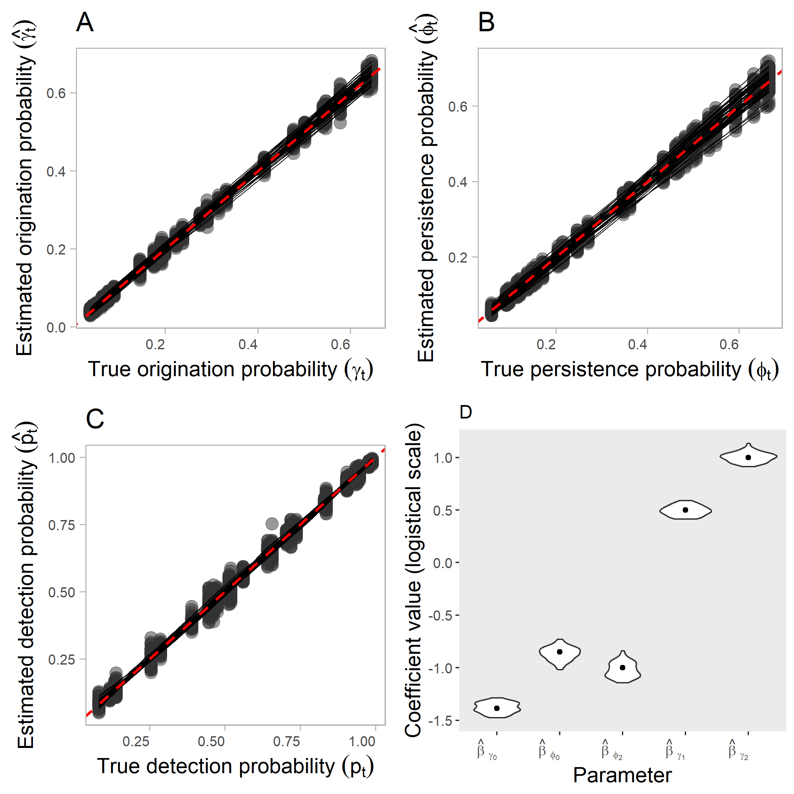

Global precipitation and land area as major determinants of the
origination and persistence of early mammalian lineages in the Mesozoic
================
AL Luza, MG Bender, CS Dambros, F Pretto, L Kerber - Departamento de
Ecologia e Evolução, Universidade Federal de Santa Maria
2024-10-08

<!-- README.md is generated from README.Rmd. Please edit that file -->
<!-- badges: start -->
<!-- badges: end -->

## Supporting Information S1

<!-- https://rdrr.io/cran/AHMbook/src/R/simDynocc_AHM2_3_Simulate_dynamic_occupancy.R -->

We made a simulation study to test whether the CMR model like we
implemented can effectively estimate origination $\gamma_t$, persistence
$\phi_t$, and detection probability $p_t$ at each time bin $t$, as well
as whether it can estimate (recover the true) the regression
coefficients. The simulations were based on simulations of the dynamic
model described in Schaub & Kery 2012, and also functions from the AHM
Book 2nd edition.

Basically we’re using data from the Paleobiology Database to estimate
taxonomic diversity, origination, persistence, and detection probability
of three groups of mammal precursors from the late Permian to the end of
the Mesozoic era (Cretaceous). We’re using the approach of Liow and
Nichols (2010, Estimating Rates and Probabilities of Origination and
Extinction Using Taxonomic Occurrence Data: Capture-Mark-Recapture (CMR)
Approaches. Paleontol. Soc. Pap. 16, 81–94) to analyze these data, where
“genera” are considered “sites”, and “time bins/geological periods” are
considered “seasons”. To run the approach we condition the data of each
group to the period before its first appearance in the fossil record. We
added to this approach/model an estimator of taxonomic diversity (number
of genera that ever existed in the end Paleozoic - end Mesozoic Eras)
following Dorazio & Royle (2005)
(<http://dx.doi.org/10.1198/016214505000000015>), and used the detection
model described in Schaub & Kery (2012). More specifically, our data
$y_{gt}$ consist of counts of the number of geological formations in
which each genus $g$ was detected in each time bin $t$. The complete
model can be summarized as:

<center>
$$ y_{gt}|z_{gt} \sim Binomial (p_t, N_t)$$
</center>
  
<center>
$$ z_{gt} \sim Bernoulli (\omega_g \times \psi_{gt})$$
</center>
  
<center>
$$ \omega_{g} \sim Bernoulli (\Omega)$$
</center>
  
<center>
$$ \psi_{gt} = z_{g,t-1} \times \phi_{t-1} + (1-z_{g,t-1}) \times \gamma_{t-1} $$
</center>
  
<center>
$$ logit(\gamma_{t},\phi_{t}) = \beta_{0x} + \beta_{1x} \times X_{1t} + \beta_{2x} \times X_{2t}$$
</center>

  

In the first level, the counts of formations in which each genus was
detected is the realization of a Binomial distribution moderated by the
probability of detection $p_t$ in time bin $t$ (representing
preservation probability $\times$ sampling probability) and the total
number of formations recovered in each period $N_t$. In the second
level, the true occurrence of genus $g$ in time $t$ is the realization
of Bernoulli distribution moderated by the probability of
‘occupancy/incidence’ of time bin $t$ by the genus $g$ and the
probability of each genus $g$ in an augmented data set to belong the
community, depicted as $\omega_g$. Finally, this $\omega_g$ is the
realization of another Bernoulli distribution moderated by $\Omega$ that
will inform about the proportion of the genus in an augmented data set
that actually belongs to the community (see also Iknayan et al. (2014)
DOI: 10.1016/j.tree.2013.10.012). Remember that the estimation of
$\omega_g$ and $\Omega$ were not evaluated in the simulations.

Core to this model is the estimate of $\psi_{gt}$, which depicts the
dynamics of genus occurrence over time bins as the result of origination
$\gamma_t$ and $\phi_t$ persistence probabilities between consecutive
time bins. These parameters can be estimated using the state-space
formulation of the dynamic model depicted in Royle & Kery (2007, A
Bayesian state-space formulation of dynamic occupancy models. Ecology.
2007 Jul;88(7):1813-23. doi: 10.1890/06-0669.1. PMID: 17645027.). It is
important that this model is able to estimate the dynamics as well the
relevant parameters in the models. As such, we focused our simulations
on this portion of the model. Interesting simulations of the community
size $\Omega$ can be found in Tingley et al. (2020, DOI:
10.1111/2041-210X.13378) and Guillera-Arroita et al. (2018, DOI:
10.1002/ece3.4821).

We made these simulations because there was an total overlap of
covariates in the models of origination $\gamma_t$ and persistence
$\phi_t$ fitted to empirical data, and this overlap might impose
challenges to the identifiability and parameter estimability of
hierarchical models (e.g. Lele et al. 2012, Dorazio 2012). Also, we
found some counter intuitive results (negative effect of land area on
persistence, positive effect on origination (when the coefficients
should be positive for both parameters considering the theory of island
biogeography of higher origination and persistence in larger islands)).

In our first simulation round, we make origination $\gamma_t$ and
persistence $\phi_t$ as the result of the same covariates, $X_{1t}$ and
$X_{2t}$, thus the overlap of covariates in the models was total. In our
second simulation round, we removed $X_{1t}$ from the model of $\phi_t$,
producing a partial overlap of covariates. In our final simulation run,
we removed $X_{2t}$ from the model of $\gamma_t$, resulting in no
overlap of covariates (probably the best situation).

We did not find any issue with the model, as it performed well with
total, partial, and not overlap of covariates. Overall, trends on
$\gamma_t$, $\phi_t$ and $p_t$ were recovered (Figs. 1-3). The intercept
and regression coefficients were also recovered. Thus no bias and lack
of precision was detected under these simulated conditions.

    ## Carregando pacotes exigidos: here

    ## here() starts at D:/Pos_Doc_Paleonto_Macroecology/modeling/paleo_macroecology


Fig. 1: Results depicting the performance of the model front to the
total overlap of covariates. In (A), we show the true values of
$\gamma_t$ per time bin in the X axis, and the estimated values in the Y
axis. In (B), we show the true values of $\phi_t$ per time bin in the X
axis, and the estimated values in the Y axis.In (C), we show the true
values of $\p_t$ per time bin in the X axis, and the estimated values in
the Y axis. In A-C, the red line depicts the 1:1 relationship of a
perfect matching between the truth and the estimated values. One
truth-estimate relationship is shown per simulated data set (n=20). In
(D), we show violin plots (produced by the 20 simulated data setes) of
the intercepts and regression coefficients. The black points depict the
true values.


Fig. 2: Results depicting the performance of the model front to the
partial overlap of covariates. In (A), we show the true values of
$\gamma_t$ per time bin in the X axis, and the estimated values in the Y
axis. In (B), we show the true values of $\phi_t$ per time bin in the X
axis, and the estimated values in the Y axis.In (C), we show the true
values of $\p_t$ per time bin in the X axis, and the estimated values in
the Y axis. In A-C, the red line depicts the 1:1 relationship of a
perfect matching between the truth and the estimated values. One
truth-estimate relationship is shown per simulated data set (n=20). In
(D), we show violin plots (produced by the 20 simulated data setes) of
the intercepts and regression coefficients. The black points depict the
true values.


Fig. 3: Results depicting the performance of the model front to no
overlap of covariates. In (A), we show the true values of $\gamma_t$ per
time bin in the X axis, and the estimated values in the Y axis. In (B),
we show the true values of $\phi_t$ per time bin in the X axis, and the
estimated values in the Y axis.In (C), we show the true values of $\p_t$
per time bin in the X axis, and the estimated values in the Y axis. In
A-C, the red line depicts the 1:1 relationship of a perfect matching
between the truth and the estimated values. One truth-estimate
relationship is shown per simulated data set (n=20). In (D), we show
violin plots (produced by the 20 simulated data setes) of the intercepts
and regression coefficients. The black points depict the true values.

## You can reproduce the first simulation study using:

``` r
# ----------------------------------------


# Simulation study

# Can the same set of covarites be included in the origination and extinction models??
# global - scale analysis ( so the genera are in the rows of the detection table )

# total overlap of covariates 

# ----------------------------------------
rm(list=ls())
require(here)
# create dir
dir.create (here ("simulations", "output"))

# Write the JAGS model
model_string <- "
model {
  
      #  Occupancy Dynamics (Priors)
       
       
        # ----------------------
        #     Gamma (origination)
        # ----------------------
        
        # intercepts
        gamma.u ~ dunif(0,1) # range origination
        intercept.gamma <- logit(gamma.u) # intercept origination
        
        # regression coeff
        beta_gamma1 ~ dunif(-20,20)
        beta_gamma2 ~ dunif(-20,20)
        
        # ----------------------
        #     Phi (persistence)
        # ----------------------
        # intercepts
        phi.u ~ dunif(0,1) # range persistence
        intercept.phi <- logit(phi.u) # intercept persistence
        
        # regression coeff
        beta_phi1 ~ dunif(-20,20)
        beta_phi2 ~ dunif(-20,20)
       
        ## set initial conditions for occupancy of each genus
        initial_psi ~ dunif(0,1)
      
       ############      Model       #############
       
       # model for phi and gamma
       ### model dynamic parameters
        
        for (t in 1:(n_bins-1)){
      
             # speciation
             logit(gamma[t]) <-  intercept.gamma + 
                                   beta_gamma1*X1[t]+
                                   beta_gamma2*X2[t]
                                   
              # persistence
              logit(phi[t]) <-  intercept.phi + 
                                  beta_phi1*X1[t]+
                                  beta_phi2*X2[t]
                                  
                                  
        }
        
        # Occupancy dynamics ---------------------
       
        for (g in 1:n_spp) {
         
            z[g,1]~dbern(initial_psi) # occupancy status initialization
      
                for (t in 2:n_bins){
              
                  # model likelihood
                  ### modeling dynamics conditional on previous time realized occurrence z
                  muZ[g,t] <- z[g,t-1] *  phi[t-1] + ### if occupied, p of not getting extinct/persist in the next time
                                (1-z[g,t-1]) *  gamma[t-1] ###  if not occupied, p of originate in the next time
                  
                 # realized occurrence
                 muZW[g,t] <- muZ[g,t]
                   z[g,t] ~ dbern(muZW[g,t])
              
          }#t
        
        } #g
  
  
    #############################################################
    #                                                           #
    #         Observation process across formations             #
    #                                                           #
    #############################################################
    
    ###  detection intercept
    # intercept    
    for (t in 1:n_bins) {
      p[t] ~ dunif(0,1) 
    }
    
    # observation submodel
    for (g in 1:n_spp) { ## loop over genera 
      
      for (t in 1:n_bins) { ## loop over time bins 
    
          # observation
          # Specify the binomial observation model conditional on occupancy state
          y[g,t] ~ dbin(muY[g,t], n_surveys[t])
          muY[g,t] <- z[g,t]*p[t]
                  
        }
      
    }
      

}

"

# Load necessary libraries
library(jagsUI)
library(here)

# Set parameters
set.seed(42)
n_spp <- 200  # Number of genera
n_bins <- 30   # Number of time bins
n_surveys <- 10  # Number of surveys (geological formations) per time bin

# Initial occupancy probability
initial_psi <- 0.3

# Detection probability
p <- runif(n_bins,0,1)  

# covariate effect on origination
intercept_gamma <- qlogis(0.2) 
beta_gamma1 <- 0.5
beta_gamma2 <- 1

# covariate effect on persistence
intercept_phi <- qlogis(0.3)  
beta_phi1 <- 1
beta_phi2 <- -1

# covariates (generate just once and save to be used in the other two simulation sets)
X1 <- runif (n_bins-1, -2, 2) 
X2 <- runif (n_bins-1, -2, 2)  
save(X1,X2, file=here("simulations","covariates.RData"))
# load(file=here("simulations","covariates.RData")) # activate after the creation
cor(cbind(X1,X2))

# scale covariates
X1<-scale(X1)[,1]
X2<-scale(X2)[,1]


# start simulations ---------------------------------

n.sims <- 20
my.seeds <- floor(runif (n.sims,0,5000))

# run
lapply (seq(1,n.sims), function (s) {
  
        # set seed
        set.seed(my.seeds[s])
        
        # Origination probability
        phi <- gamma <- array(NA, dim = (n_bins-1)) # persistence, colonisation
         
        # produce transition probs
        for(t in 1:(n_bins-1)){
          
            # origination 
            gamma[t] <- plogis(intercept_gamma+beta_gamma1*X1[t]+
                                      beta_gamma2*X2[t])
            
            # persistence probability
            phi[t] <- plogis(intercept_phi+beta_phi1*X1[t]+
                                    beta_phi2*X2[t])# back to prob scale
            
            
        }
        
        # Simulate occupancy states
        z <- array(NA, dim = c(n_spp, n_bins))
        muZ <- array(NA, dim = c(n_spp, n_bins))
        z[, 1] <- rbinom(n_spp, 1, initial_psi)
        
        # true incidence
        for (i in 1:n_spp) {
            for (t in 2:n_bins) {
              muZ[i,t] <- z[i, t - 1] * phi[t-1] + (1 - z[i, t - 1]) * gamma[t-1]
              z[i, t] <- rbinom(1, 1, muZ[i,t])
          }
        }
        
        # Simulate detections
        y <- array(NA, dim = c(n_spp, n_bins))
        for (i in 1:n_spp) {
          for (t in 1:n_bins) {
            
              y[i, t] <- rbinom(1, rep(n_surveys,n_bins), z[i, t] * p[t])
            
          }
        }
        
        #save data
        save (y,z ,muZ,p, phi,gamma, file = here ("simulations", "output", paste0("data_", s,".RData")))
        
        # Prepare data for JAGS
        jags_data <- list(
          y = y,
          n_spp = n_spp,
          n_bins = n_bins,
          n_surveys = rep(n_surveys,n_bins),
          X1=X1,
          X2=X2
        )
        
        # Initial values for the latent states
        init_values <- function() {
          list(z = ifelse(y>0,1,0),
               phi.u = 0.3,
               gamma.u=0.2
               
               )
        }
        
        # Parameters to monitor
        parameters <- c("intercept.phi",
                        "beta_phi1",
                        "beta_phi2",
                        "intercept.gamma",
                        "beta_gamma1",
                        "beta_gamma2",
                        "initial_psi", 
                        "gamma",
                        "phi",
                        "p", 
                        "muZ")
        
        # Run JAGS model
        ## MCMC runs
        samples <-jags (data = jags_data, 
                        parameters.to.save = parameters, 
                        model.file = textConnection(model_string), 
                        inits = init_values, 
                        n.chains = 3, 
                        n.thin = 1, 
                        n.iter = 500,
                        n.adapt = 200,
                        n.burnin = 400, 
                        DIC = T,  
                        parallel=F
        )
        
        # extract summary
        point_estimates <- samples$summary
        
        #save
        save (point_estimates, file = here ("simulations", "output", paste0("sims_run", s,".RData")))
        
        
})

# end
```

You can generate the arrange of plots using the following code:

``` r
# ----------------------------------------

# Load necessary libraries --------------------------------------
rm(list=ls())
library(rjags)
library(here)

# create dir
dir.create (here ("simulations", "figs"))

# load output ---------------------------------
# results
filenames <- list.files(here ("simulations", "output"), full.names=T, pattern = "sims_run")
results <- sapply(filenames, function(x) mget(load(x)), simplify = TRUE)

# simulated data
filenames <- list.files(here ("simulations", "output"), full.names=T,pattern = "data")
simdata <- sapply(filenames, function(x) mget(load(x)), simplify = F)

# bind
df_res <- do.call(rbind,results)

# find variables I want
hat_gamma <- df_res [grep("gamma", rownames(df_res)),]
hat_gamma <- hat_gamma [-grep("intercept",rownames(hat_gamma)),] # remove intercept
hat_gamma <- hat_gamma [-grep("beta",rownames(hat_gamma)),] # remove coeffs

# plot
require(reshape)
require(dplyr)
require(ggplot2)

my_theme <- theme(legend.position = 'bottom', 
                  strip.text = element_text(size=12),
                  strip.text.y = element_text(color = 'black'),
                  strip.text.x = element_text(color = 'black'), 
                  #text = element_text(family="LM Roman 10"),
                  panel.grid.major = element_blank(),
                  panel.grid.minor = element_blank(),
                  axis.text.x = element_text(angle = 0, hjust = 1, size = 10), 
                  axis.text.y = element_text(size = 10),
                  axis.title = element_text(size=15))

# plot phi and gamma --------------------------------------------

p_gamma<-data.frame (hat_gamma = melt(matrix(hat_gamma[,"mean"],ncol=20,byrow=F)),
            true_gamma = melt(sapply (simdata, "[[","gamma" ))[,3]) %>%
  ggplot() +
  theme_light(base_size = 16) +
  geom_point(aes(x = true_gamma, y = hat_gamma.value,group=hat_gamma.X2),alpha=0.5,col="gray20",size=4)+
  geom_smooth(aes(x = true_gamma, y = hat_gamma.value,group=hat_gamma.X2), col = 'black', alpha = 1, se = F, 
              lineend = 'round', lwd = 0.25) +
  geom_abline(slope = 1, intercept = 0, col = 'red', lty = 2,linewidth=1) +
  labs(y=bquote("Estimated origination probability "*(hat(gamma[t]))*""),
       x=bquote("True origination probability "*(gamma[t])*""))+
  ggtitle ("A")+my_theme

# phi ----------
hat_phi <- df_res [grep("phi", rownames(df_res)),]
hat_phi <- hat_phi [-grep("intercept",rownames(hat_phi)),] # remove intercept
hat_phi <- hat_phi [-grep("beta",rownames(hat_phi)),] # remove coeffs

# plot
p_phi<-data.frame (hat_phi = melt(matrix(hat_phi[,"mean"],ncol=20,byrow=F)),
                   true_phi = melt(sapply (simdata, "[[","phi" ))[,3]) %>%
  ggplot() +
  theme_light(base_size = 16) +
  geom_point(aes(x = true_phi, y = hat_phi.value,group=hat_phi.X2),alpha=0.5,col="gray20",size=4)+
  geom_smooth(aes(x = true_phi, y = hat_phi.value,group=hat_phi.X2), col = 'black', alpha = 1, se = F, 
              lineend = 'round', lwd = 0.25) +
  geom_abline(slope = 1, intercept = 0, col = 'red', lty = 2,linewidth=1) +
  labs(y=bquote("Estimated persistence probability "*(hat(phi[t]))*""),
       x=bquote("True persistence probability "*(phi[t])*""))+
  ggtitle ("B")+my_theme


# plot p --------------

plot_p <- data.frame (p_est = melt(matrix(df_res [grepl("p\\[", ignore.case = T, rownames(df_res)),"mean"],nrow=30,byrow=F)),
                      lab_p=as.character(expression(paste(p))),
                      p_true = melt(sapply (simdata, "[[","p" ))[,3]) %>%
  ggplot() +
  theme_light(base_size = 16) +
  geom_point(aes(x = p_true, y = p_est.value,group=p_est.X2),alpha=0.5,col="gray20",size=4)+
  geom_smooth(aes(x = p_true, y = p_est.value,group=p_est.X2), col = 'black', alpha = 1, se = F, 
              lineend = 'round', lwd = 0.25) +
  geom_abline(slope = 1, intercept = 0, col = 'red', lty = 2,linewidth=1) +
  labs(y=bquote("Estimated detection probability "*(hat(p[t]))*""),
       x=bquote("True detection probability "*(p[t])*""))+
  ggtitle ("C")+my_theme


# reegression coefs ---------------------------------

coef_plot <- data.frame (intercept.gamma = (df_res [grepl("\\intercept.gamma\\b$", ignore.case = T, rownames(df_res)),"mean"]),
            intercept.phi  = (df_res [grepl("\\intercept.phi\\b$", ignore.case = T, rownames(df_res)),"mean"]),
            beta_phi1 = df_res [grepl("\\bbeta_phi1\\b$", ignore.case = T, rownames(df_res)),"mean"],
            beta_phi2 = df_res [grepl("\\bbeta_phi2\\b$", ignore.case = T, rownames(df_res)),"mean"],
            beta_gamma1 = df_res [grepl("\\bbeta_gamma1\\b$", ignore.case = T, rownames(df_res)),"mean"],
            beta_gamma2 = df_res [grepl("\\bbeta_gamma2\\b$", ignore.case = T, rownames(df_res)),"mean"]) %>%
  melt () %>%
  ggplot (aes (y=value, x=variable)) +
  scale_x_discrete(labels=c(expression(paste(hat(beta), " "[gamma[0]])),
                            expression(paste(hat(beta), " "[phi[0]])),
                            expression(paste(hat(beta), " "[phi[1]])),
                            expression(paste(hat(beta), " "[phi[2]])),
                            expression(paste(hat(beta), " "[gamma[1]])),
                            expression(paste(hat(beta), " "[gamma[2]]))
                            
                            
                            ))+
  labs(y="Coefficient value (logistical scale)", x="Parameter")+
  geom_violin() +
  geom_point (aes(x=1, y=qlogis(0.2)))+
  geom_point (aes(x=2, y=qlogis(0.3)))+
  geom_point (aes(x=3, y=1))+
  geom_point (aes(x=4, y=-1))+
  geom_point (aes(x=5, y=0.5))+
  geom_point (aes(x=6, y=1))+
  ggtitle ("D")+my_theme

# coverage
# gamma
cbind (df_res [grepl("\\intercept.gamma\\b$", ignore.case = T, rownames(df_res)),c("2.5%", "97.5%")],
       qlogis(0.2) ) %>%
  data.frame () %>%
  mutate(is_in_range = qlogis(0.2) > X2.5. & qlogis(0.2) < X97.5.) %>% # Create TRUE/FALSE column
  summarise(total_TRUEs = sum(is_in_range)) # Sum number of TRUEs

# phi
cbind (df_res [grepl("\\intercept.phi\\b$", ignore.case = T, rownames(df_res)),c("2.5%", "97.5%")],
       qlogis(0.3)) %>%
  data.frame () %>%
  mutate(is_in_range = qlogis(0.3) > X2.5. & qlogis(0.3) < X97.5.) %>% # Create TRUE/FALSE column
  summarise(total_TRUEs = sum(is_in_range)) # Sum number of TRUEs

# arrange plot
require(gridExtra)
png(file = here("simulations", "figs", "sc1.png"),width = 20,height = 20,units = "cm",res=300)
grid.arrange (p_gamma, p_phi,
              plot_p,coef_plot,ncol=2)

dev.off()

# end
```

## You can reproduce the second simulation study using the following lines of code:

``` r
# ----------------------------------------


# Simulation study

# Can the same set of covarites be included in the origination and extinction models??
# global - scale analysis ( so the genera are in the rows of the detection table )

# partial overlap of covariates

# ----------------------------------------
rm(list=ls())
require(here)
dir.create (here ("simulations", "output2"))

# Write the JAGS model
model_string <- "
model {
  
      # Site Occupancy Dynamics (Priors)
       
       
        # ----------------------
        #     Gamma (origination)
        # ----------------------
        
        # intercepts
        gamma.u ~ dunif(0,1) # range origination
        intercept.gamma <- logit(gamma.u) # intercept origination
        # regression coeff
        beta_gamma1 ~ dunif(-20,20)
        beta_gamma2 ~ dunif(-20,20)
        
        # ----------------------
        #     Phi (persistence)
        # ----------------------
        # intercepts
        phi.u ~ dunif(0,1) # range persistence
        intercept.phi <- logit(phi.u) # intercept persistence
        # regression coeff
        beta_phi2 ~ dunif(-20,20)
        
        
        ## set initial conditions for occupancy of each genus
        initial_psi ~ dunif(0,1)
        
           
       ############      Model       #############
       
       # model for phi and gamma
       ### model dynamic parameters
        
        for (t in 1:(n_bins-1)){
      
             # speciation
             logit(gamma[t]) <-  intercept.gamma + 
                                   beta_gamma1*X1[t]+
                                   beta_gamma2*X2[t]
                                   
              # persistence
              logit(phi[t]) <-  intercept.phi + 
                                  beta_phi2*X2[t]
                                  
                                  
        }
        
       
                       
      # occupancy dynamics
       
        for (g in 1:n_spp) {
         
            z[g,1]~dbern(initial_psi) # occupancy status initialization
      
                for (t in 2:n_bins){
              
                  # model likelihood
                  ### modeling dynamics conditional on previous time realized occurrence z
                  muZ[g,t] <- z[g,t-1] *  phi[t-1] + ### if occupied, p of not getting extinct/persist in the next time
                                (1-z[g,t-1]) *  gamma[t-1] ###  if not occupied, p of originate in the next time
                  
                 # realized occurrence
                 muZW[g,t] <- muZ[g,t]
                   z[g,t] ~ dbern(muZW[g,t])
              
          }#t
        
        } #g
  
  
    #############################################################
    #                                                           #
    #         Observation process across formations             #
    #                                                           #
    #############################################################
    
    ###  detection intercept
    # intercept    
    for (t in 1:n_bins) {
      p[t] ~ dunif(0,1) # constant detection
    }
    
    # observation submodel
    for (g in 1:n_spp) { ## loop over observations 
      
      for (t in 1:n_bins) { ## loop over observations 
    
          # observation
          # Specify the binomial observation model conditional on occupancy state
          y[g,t] ~ dbin(muY[g,t], n_surveys[t])
          muY[g,t] <- z[g,t]*p[t]
                  
        }
      
    }
      

}

"

# Load necessary libraries
library(jagsUI)
library(here)

# Set parameters
set.seed(42)
n_spp <- 200  # Number of sites
n_bins <- 30   # Number of time bins
n_surveys <- 10  # Number of surveys (geological formations) per time bin

# Initial occupancy probability
initial_psi <- 0.3

# Detection probability
p <- runif(n_bins,0,1)  

# covariate effect on origination
intercept_gamma <- qlogis(0.2) 
beta_gamma1 <- 0.5
beta_gamma2 <- 1

# covariate effect on persistence
intercept_phi <- qlogis(0.3)  
#beta_phi1 <- 1
beta_phi2 <- -1

# covariates
load(file=here("simulations","covariates.RData"))
cor(cbind(X1,X2))

# scale
X1<-scale(X1)[,1]
X2<-scale(X2)[,1]


# start simulations ---------------------------------

n.sims <- 20
my.seeds <- floor(runif (n.sims,0,5000))

# run
lapply (seq(1,n.sims), function (s) {
  
        # set seed
        set.seed(my.seeds[s])
        
        # Origination probability
        phi <- gamma <- array(NA, dim = (n_bins-1)) # persistence, colonisation
         
        # produce transition probs
        for(t in 1:(n_bins-1)){
          
            # origination 
            gamma[t] <- plogis(intercept_gamma+beta_gamma1*X1[t]+
                               beta_gamma2*X2[t])
            
            # persistence probability
            phi[t] <- plogis(intercept_phi+
                             beta_phi2*X2[t])# back to prob scale
            
            
        }
        
        # Simulate occupancy states
        z <- array(NA, dim = c(n_spp, n_bins))
        muZ <- array(NA, dim = c(n_spp, n_bins))
        z[, 1] <- rbinom(n_spp, 1, initial_psi)
        
        # true incidence
        for (i in 1:n_spp) {
            for (t in 2:n_bins) {
              muZ[i,t] <- z[i, t - 1] * phi[t-1] + (1 - z[i, t - 1]) * gamma[t-1]
              z[i, t] <- rbinom(1, 1, muZ[i,t])
          }
        }
        
        # Simulate detections
        y <- array(NA, dim = c(n_spp, n_bins))
        for (i in 1:n_spp) {
          for (t in 1:n_bins) {
            
              y[i, t] <- rbinom(1, rep(n_surveys,n_bins), z[i, t] * p[t])
            
          }
        }
        
        #save data
        save (y,z ,muZ,p, phi,gamma, file = here ("simulations", "output2", paste0("data_", s,".RData")))
        
        # Prepare data for JAGS
        jags_data <- list(
          y = y,
          n_spp = n_spp,
          n_bins = n_bins,
          n_surveys = rep(n_surveys,n_bins),
          X1=X1,
          X2=X2
        )
        
        # Initial values for the latent states
        init_values <- function() {
          list(z = ifelse(y>0,1,0),
               phi.u = 0.3,
               gamma.u=0.2
               
               )
        }
        
        # Parameters to monitor
        parameters <- c("intercept.phi",
                        "beta_phi2",
                        "intercept.gamma",
                        "beta_gamma1",
                        "beta_gamma2",
                        "initial_psi", 
                        "gamma",
                        "phi",
                        "p", 
                        "muZ")
        
        
        # Run JAGS model
        ## MCMC runs
        samples <-jags (data = jags_data, 
                        parameters.to.save = parameters, 
                        model.file = textConnection(model_string), 
                        inits = init_values, 
                        n.chains = 3, 
                        n.thin = 1, 
                        n.iter = 500,
                        n.adapt = 200,
                        n.burnin = 400, 
                        DIC = T,  
                        parallel=F
        )
        
        # extract summary
        point_estimates <- samples$summary
        
        #save
        save (point_estimates, file = here ("simulations", "output2", paste0("sims_run", s,".RData")))
        
        
})

# end
```

You can generate the arrange of plots using the following code:

``` r
# ----------------------------------------

# Load necessary libraries --------------------------------------
rm(list=ls())
library(rjags)
library(here)

# load output ---------------------------------
# results
filenames <- list.files(here ("simulations", "output2"), full.names=T, pattern = "sims_run")
results <- sapply(filenames, function(x) mget(load(x)), simplify = TRUE)

# simulated data
filenames <- list.files(here ("simulations", "output2"), full.names=T,pattern = "data")
simdata <- sapply(filenames, function(x) mget(load(x)), simplify = F)

# bind
df_res <- do.call(rbind,results)

# find variables I want
hat_gamma <- df_res [grep("gamma", rownames(df_res)),]
hat_gamma <- hat_gamma [-grep("intercept",rownames(hat_gamma)),] # remove intercept
hat_gamma <- hat_gamma [-grep("beta",rownames(hat_gamma)),] # remove coeffs

# plot
require(reshape)
require(dplyr)
require(ggplot2)

my_theme <- theme(legend.position = 'bottom', 
                  strip.text = element_text(size=12),
                  strip.text.y = element_text(color = 'black'),
                  strip.text.x = element_text(color = 'black'), 
                  #text = element_text(family="LM Roman 10"),
                  panel.grid.major = element_blank(),
                  panel.grid.minor = element_blank(),
                  axis.text.x = element_text(angle = 0, hjust = 1, size = 10), 
                  axis.text.y = element_text(size = 10),
                  axis.title = element_text(size=15))

# plot phi and gamma --------------------------------------------

p_gamma<-data.frame (hat_gamma = melt(matrix(hat_gamma[,"mean"],ncol=20,byrow=F)),
            true_gamma = melt(sapply (simdata, "[[","gamma" ))[,3]) %>%
  ggplot() +
  theme_light(base_size = 16) +
  geom_point(aes(x = true_gamma, y = hat_gamma.value,group=hat_gamma.X2),alpha=0.5,col="gray20",size=4)+
  geom_smooth(aes(x = true_gamma, y = hat_gamma.value,group=hat_gamma.X2), col = 'black', alpha = 1, se = F, 
              lineend = 'round', lwd = 0.25) +
  geom_abline(slope = 1, intercept = 0, col = 'red', lty = 2,linewidth=1) +
  labs(y=bquote("Estimated origination probability "*(hat(gamma[t]))*""),
       x=bquote("True origination probability "*(gamma[t])*""))+
  ggtitle ("A")+my_theme

# phi ----------
hat_phi <- df_res [grep("phi", rownames(df_res)),]
hat_phi <- hat_phi [-grep("intercept",rownames(hat_phi)),] # remove intercept
hat_phi <- hat_phi [-grep("beta",rownames(hat_phi)),] # remove coeffs

# plot
p_phi<-data.frame (hat_phi = melt(matrix(hat_phi[,"mean"],ncol=20,byrow=F)),
                   true_phi = melt(sapply (simdata, "[[","phi" ))[,3]) %>%
  ggplot() +
  theme_light(base_size = 16) +
  geom_point(aes(x = true_phi, y = hat_phi.value,group=hat_phi.X2),alpha=0.5,col="gray20",size=4)+
  geom_smooth(aes(x = true_phi, y = hat_phi.value,group=hat_phi.X2), col = 'black', alpha = 1, se = F, 
              lineend = 'round', lwd = 0.25) +
  geom_abline(slope = 1, intercept = 0, col = 'red', lty = 2,linewidth=1) +
  labs(y=bquote("Estimated persistence probability "*(hat(phi[t]))*""),
       x=bquote("True persistence probability "*(phi[t])*""))+
  ggtitle ("B")+my_theme


# plot p --------------

plot_p <- data.frame (p_est = melt(matrix(df_res [grepl("p\\[", ignore.case = T, rownames(df_res)),"mean"],nrow=30,byrow=F)),
                      lab_p=as.character(expression(paste(p))),
                      p_true = melt(sapply (simdata, "[[","p" ))[,3]) %>%
  ggplot() +
  theme_light(base_size = 16) +
  geom_point(aes(x = p_true, y = p_est.value,group=p_est.X2),alpha=0.5,col="gray20",size=4)+
  geom_smooth(aes(x = p_true, y = p_est.value,group=p_est.X2), col = 'black', alpha = 1, se = F, 
              lineend = 'round', lwd = 0.25) +
  geom_abline(slope = 1, intercept = 0, col = 'red', lty = 2,linewidth=1) +
  labs(y=bquote("Estimated detection probability "*(hat(p[t]))*""),
       x=bquote("True detection probability "*(p[t])*""))+
  ggtitle ("C")+my_theme


# reegression coefs ---------------------------------

  coef_plot <- data.frame (intercept.gamma = (df_res [grepl("\\intercept.gamma\\b$", ignore.case = T, rownames(df_res)),"mean"]),
            intercept.phi  = (df_res [grepl("\\intercept.phi\\b$", ignore.case = T, rownames(df_res)),"mean"]),
            beta_phi2 = df_res [grepl("\\bbeta_phi2\\b$", ignore.case = T, rownames(df_res)),"mean"],
            beta_gamma1 = df_res [grepl("\\bbeta_gamma1\\b$", ignore.case = T, rownames(df_res)),"mean"],
            beta_gamma2 = df_res [grepl("\\bbeta_gamma2\\b$", ignore.case = T, rownames(df_res)),"mean"]) %>%
  melt () %>%
  ggplot (aes (y=value, x=variable)) +
  scale_x_discrete(labels=c(expression(paste(hat(beta), " "[gamma[0]])),
                            expression(paste(hat(beta), " "[phi[0]])),
                            expression(paste(hat(beta), " "[phi[2]])),
                            expression(paste(hat(beta), " "[gamma[1]])),
                            expression(paste(hat(beta), " "[gamma[2]]))
                            
                            
                            ))+
  labs(y="Coefficient value (logistical scale)", x="Parameter")+
  geom_violin() +
  geom_point (aes(x=1, y=qlogis(0.2)))+
  geom_point (aes(x=2, y=qlogis(0.3)))+
  geom_point (aes(x=3, y=-1))+
  geom_point (aes(x=4, y=0.5))+
  geom_point (aes(x=5, y=1))+
  ggtitle ("D")+my_theme


# coverage
# gamma
cbind (df_res [grepl("\\intercept.gamma\\b$", ignore.case = T, rownames(df_res)),c("2.5%", "97.5%")],
       qlogis(0.2) ) %>%
  data.frame () %>%
  mutate(is_in_range = qlogis(0.2) > X2.5. & qlogis(0.2) < X97.5.) %>% # Create TRUE/FALSE column
  summarise(total_TRUEs = sum(is_in_range)) # Sum number of TRUEs

# phi
cbind (df_res [grepl("\\intercept.phi\\b$", ignore.case = T, rownames(df_res)),c("2.5%", "97.5%")],
       qlogis(0.3)) %>%
  data.frame () %>%
  mutate(is_in_range = qlogis(0.3) > X2.5. & qlogis(0.3) < X97.5.) %>% # Create TRUE/FALSE column
  summarise(total_TRUEs = sum(is_in_range)) # Sum number of TRUEs


# arrange plot
require(gridExtra)
png(file = here("simulations", "figs", "sc2.png"),width = 20,height = 20,units = "cm",res=300)
grid.arrange (p_gamma, p_phi,
              plot_p,coef_plot,ncol=2)

dev.off()

# end
```

## Finally, you can reproduce the third simulation study using the following lines of code:

``` r
# ----------------------------------------


# Simulation study

# Can the same set of covarites be included in the origination and extinction models??
# global - scale analysis ( so the genera are in the rows of the detection table )

# ----------------------------------------
rm(list=ls())
require(here)
dir.create (here ("simulations", "output3"))

# Write the JAGS model
model_string <- "
model {
  
      # Site Occupancy Dynamics (Priors)
       
       
        # ----------------------
        #     Gamma (origination)
        # ----------------------
        
        # intercepts
        gamma.u ~ dunif(0,1) # range origination
        intercept.gamma <- logit(gamma.u) # intercept origination
        # regression coeff
        beta_gamma1 ~ dunif(-20,20)
        
        # ----------------------
        #     Phi (persistence)
        # ----------------------
        # intercepts
        phi.u ~ dunif(0,1) # range persistence
        intercept.phi <- logit(phi.u) # intercept persistence
        # regression coeff
        beta_phi2 ~ dunif(-20,20)
        
        
        ## set initial conditions for occupancy of each genus
        initial_psi ~ dunif(0,1)
        
           
       ############      Model       #############
       
       # model for phi and gamma
       ### model dynamic parameters
        
        for (t in 1:(n_bins-1)){
      
             # speciation
             logit(gamma[t]) <-  intercept.gamma + 
                                   beta_gamma1*X1[t]
                                   
              # persistence
              logit(phi[t]) <-  intercept.phi + 
                                  beta_phi2*X2[t]
                                  
                                  
        }
        
       
                       
      # occupancy dynamics
       
        for (g in 1:n_spp) {
         
            z[g,1]~dbern(initial_psi) # occupancy status initialization
      
                for (t in 2:n_bins){
              
                  # model likelihood
                  ### modeling dynamics conditional on previous time realized occurrence z
                  muZ[g,t] <- z[g,t-1] *  phi[t-1] + ### if occupied, p of not getting extinct/persist in the next time
                                (1-z[g,t-1]) *  gamma[t-1] ###  if not occupied, p of originate in the next time
                  
                 # realized occurrence
                 muZW[g,t] <- muZ[g,t]
                   z[g,t] ~ dbern(muZW[g,t])
              
          }#t
        
        } #g
  
  
    #############################################################
    #                                                           #
    #         Observation process across formations             #
    #                                                           #
    #############################################################
    
    ###  detection intercept
    # intercept    
    for (t in 1:n_bins) {
      p[t] ~ dunif(0,1) # constant detection
    }
    
    # observation submodel
    for (g in 1:n_spp) { ## loop over observations 
      
      for (t in 1:n_bins) { ## loop over observations 
    
          # observation
          # Specify the binomial observation model conditional on occupancy state
          y[g,t] ~ dbin(muY[g,t], n_surveys[t])
          muY[g,t] <- z[g,t]*p[t]
                  
        }
      
    }
      

}

"

# Load necessary libraries
library(jagsUI)
library(here)

# Set parameters
set.seed(42)
n_spp <- 200  # Number of sites
n_bins <- 30   # Number of time bins
n_surveys <- 10  # Number of surveys (geological formations) per time bin

# Initial occupancy probability
initial_psi <- 0.3

# Detection probability
p <- runif(n_bins,0,1)  

# covariate effect on origination
intercept_gamma <- qlogis(0.2) 
beta_gamma1 <- 0.5

# covariate effect on persistence
intercept_phi <- qlogis(0.3)  
beta_phi2 <- -1

# covariates
load(file=here("simulations","covariates.RData"))
cor(cbind(X1,X2))

# scale
X1<-scale(X1)[,1]
X2<-scale(X2)[,1]

# start simulations ---------------------------------

n.sims <- 20
my.seeds <- floor(runif (n.sims,0,5000))

# run
lapply (seq(1,n.sims), function (s) {
  
        # set seed
        set.seed(my.seeds[s])
        
        # Origination probability
        phi <- gamma <- array(NA, dim = (n_bins-1)) # persistence, colonisation
         
        # produce transition probs
        for(t in 1:(n_bins-1)){
          
            # origination 
            gamma[t] <- plogis(intercept_gamma+beta_gamma1*X1[t])
            
            # persistence probability
            phi[t] <- plogis(intercept_phi+
                                    beta_phi2*X2[t])# back to prob scale
            
            
        }
        
        # Simulate occupancy states
        z <- array(NA, dim = c(n_spp, n_bins))
        muZ <- array(NA, dim = c(n_spp, n_bins))
        z[, 1] <- rbinom(n_spp, 1, initial_psi)
        
        # true incidence
        for (i in 1:n_spp) {
            for (t in 2:n_bins) {
              muZ[i,t] <- z[i, t - 1] * phi[t-1] + (1 - z[i, t - 1]) * gamma[t-1]
              z[i, t] <- rbinom(1, 1, muZ[i,t])
          }
        }
        
        # Simulate detections
        y <- array(NA, dim = c(n_spp, n_bins))
        for (i in 1:n_spp) {
          for (t in 1:n_bins) {
            
              y[i, t] <- rbinom(1, rep(n_surveys,n_bins), z[i, t] * p[t])
            
          }
        }
        
        #save data
        save (y,z ,muZ,p, phi,gamma, file = here ("simulations", "output3", paste0("data_", s,".RData")))
        
        # Prepare data for JAGS
        jags_data <- list(
          y = y,
          n_spp = n_spp,
          n_bins = n_bins,
          n_surveys = rep(n_surveys,n_bins),
          X1=X1,
          X2=X2
        )
        
        # Initial values for the latent states
        init_values <- function() {
          list(z = ifelse(y>0,1,0),
               phi.u = 0.3,
               gamma.u=0.2
               
               )
        }
        
        # Parameters to monitor
        parameters <- c("intercept.phi",
                        "beta_phi2",
                        "intercept.gamma",
                        "beta_gamma1",
                        "initial_psi", 
                        "gamma",
                        "phi",
                        "p", 
                        "muZ")
        
        # Run JAGS model
        ## MCMC runs
        samples <-jags (data = jags_data, 
                        parameters.to.save = parameters, 
                        model.file = textConnection(model_string), 
                        inits = init_values, 
                        n.chains = 3, 
                        n.thin = 1, 
                        n.iter = 500,
                        n.adapt = 200,
                        n.burnin = 400, 
                        DIC = T,  
                        parallel=F
        )
        
        # extract summary
        point_estimates <- samples$summary
        
        #save
        save (point_estimates, file = here ("simulations", "output3", paste0("sims_run", s,".RData")))
        
        
})

# end
```

You can generate the arrange of plots using the following code:

``` r
# ----------------------------------------

# Load necessary libraries --------------------------------------
rm(list=ls())
library(rjags)
library(here)

# load output ---------------------------------
# results
filenames <- list.files(here ("simulations", "output3"), full.names=T, pattern = "sims_run")
results <- sapply(filenames, function(x) mget(load(x)), simplify = TRUE)

# simulated data
filenames <- list.files(here ("simulations", "output3"), full.names=T,pattern = "data")
simdata <- sapply(filenames, function(x) mget(load(x)), simplify = F)

# bind
df_res <- do.call(rbind,results)

# find variables I want
hat_gamma <- df_res [grep("gamma", rownames(df_res)),]
hat_gamma <- hat_gamma [-grep("intercept",rownames(hat_gamma)),] # remove intercept
hat_gamma <- hat_gamma [-grep("beta",rownames(hat_gamma)),] # remove coeffs

# plot
require(reshape)
require(dplyr)
require(ggplot2)

my_theme <- theme(legend.position = 'bottom', 
                  strip.text = element_text(size=12),
                  strip.text.y = element_text(color = 'black'),
                  strip.text.x = element_text(color = 'black'), 
                  #text = element_text(family="LM Roman 10"),
                  panel.grid.major = element_blank(),
                  panel.grid.minor = element_blank(),
                  axis.text.x = element_text(angle = 0, hjust = 1, size = 10), 
                  axis.text.y = element_text(size = 10),
                  axis.title = element_text(size=15))

# plot phi and gamma --------------------------------------------

p_gamma<-data.frame (hat_gamma = melt(matrix(hat_gamma[,"mean"],ncol=20,byrow=F)),
            true_gamma = melt(sapply (simdata, "[[","gamma" ))[,3]) %>%
  ggplot() +
  theme_light(base_size = 16) +
  geom_point(aes(x = true_gamma, y = hat_gamma.value,group=hat_gamma.X2),alpha=0.5,col="gray20",size=4)+
  geom_smooth(aes(x = true_gamma, y = hat_gamma.value,group=hat_gamma.X2), col = 'black', alpha = 1, se = F, 
              lineend = 'round', lwd = 0.25) +
  geom_abline(slope = 1, intercept = 0, col = 'red', lty = 2,linewidth=1) +
  labs(y=bquote("Estimated origination probability "*(hat(gamma[t]))*""),
       x=bquote("True origination probability "*(gamma[t])*""))+
  ggtitle ("A")+my_theme

# phi ----------
hat_phi <- df_res [grep("phi", rownames(df_res)),]
hat_phi <- hat_phi [-grep("intercept",rownames(hat_phi)),] # remove intercept
hat_phi <- hat_phi [-grep("beta",rownames(hat_phi)),] # remove coeffs

# plot
p_phi<-data.frame (hat_phi = melt(matrix(hat_phi[,"mean"],ncol=20,byrow=F)),
                   true_phi = melt(sapply (simdata, "[[","phi" ))[,3]) %>%
  ggplot() +
  theme_light(base_size = 16) +
  geom_point(aes(x = true_phi, y = hat_phi.value,group=hat_phi.X2),alpha=0.5,col="gray20",size=4)+
  geom_smooth(aes(x = true_phi, y = hat_phi.value,group=hat_phi.X2), col = 'black', alpha = 1, se = F, 
              lineend = 'round', lwd = 0.25) +
  geom_abline(slope = 1, intercept = 0, col = 'red', lty = 2,linewidth=1) +
  labs(y=bquote("Estimated persistence probability "*(hat(phi[t]))*""),
       x=bquote("True persistence probability "*(phi[t])*""))+
  ggtitle ("B")+my_theme


# plot p --------------

plot_p <- data.frame (p_est = melt(matrix(df_res [grepl("p\\[", ignore.case = T, rownames(df_res)),"mean"],nrow=30,byrow=F)),
                      lab_p=as.character(expression(paste(p))),
                      p_true = melt(sapply (simdata, "[[","p" ))[,3]) %>%
  ggplot() +
  theme_light(base_size = 16) +
  geom_point(aes(x = p_true, y = p_est.value,group=p_est.X2),alpha=0.5,col="gray20",size=4)+
  geom_smooth(aes(x = p_true, y = p_est.value,group=p_est.X2), col = 'black', alpha = 1, se = F, 
              lineend = 'round', lwd = 0.25) +
  geom_abline(slope = 1, intercept = 0, col = 'red', lty = 2,linewidth=1) +
  labs(y=bquote("Estimated detection probability "*(hat(p[t]))*""),
       x=bquote("True detection probability "*(p[t])*""))+
  ggtitle ("C")+my_theme


# reegression coefs ---------------------------------

  coef_plot <- data.frame (intercept.gamma = (df_res [grepl("\\intercept.gamma\\b$", ignore.case = T, rownames(df_res)),"mean"]),
            intercept.phi  = (df_res [grepl("\\intercept.phi\\b$", ignore.case = T, rownames(df_res)),"mean"]),
            beta_phi2 = df_res [grepl("\\bbeta_phi2\\b$", ignore.case = T, rownames(df_res)),"mean"],
            beta_gamma1 = df_res [grepl("\\bbeta_gamma1\\b$", ignore.case = T, rownames(df_res)),"mean"]) %>%
  melt () %>%
  ggplot (aes (y=value, x=variable)) +
  scale_x_discrete(labels=c(expression(paste(hat(beta), " "[gamma[0]])),
                            expression(paste(hat(beta), " "[phi[0]])),
                            expression(paste(hat(beta), " "[phi[2]])),
                            expression(paste(hat(beta), " "[gamma[1]]))
                            
                            ))+
  labs(y="Coefficient value (logistical scale)", x="Parameter")+
  geom_violin() +
  geom_point (aes(x=1, y=qlogis(0.2)))+
  geom_point (aes(x=2, y=qlogis(0.3)))+
  geom_point (aes(x=3, y=-1))+
  geom_point (aes(x=4, y=0.5))+
  ggtitle ("D")+my_theme


# coverage
# gamma
cbind (df_res [grepl("\\intercept.gamma\\b$", ignore.case = T, rownames(df_res)),c("2.5%", "97.5%")],
       qlogis(0.2) ) %>%
  data.frame () %>%
  mutate(is_in_range = qlogis(0.2) > X2.5. & qlogis(0.2) < X97.5.) %>% # Create TRUE/FALSE column
  summarise(total_TRUEs = sum(is_in_range)) # Sum number of TRUEs

# phi
cbind (df_res [grepl("\\intercept.phi\\b$", ignore.case = T, rownames(df_res)),c("2.5%", "97.5%")],
       qlogis(0.3)) %>%
  data.frame () %>%
  mutate(is_in_range = qlogis(0.3) > X2.5. & qlogis(0.3) < X97.5.) %>% # Create TRUE/FALSE column
  summarise(total_TRUEs = sum(is_in_range)) # Sum number of TRUEs


# arrange plot
require(gridExtra)
png(file = here("simulations", "figs", "sc3.png"),width = 20,height = 20,units = "cm",res=300)
grid.arrange (p_gamma, p_phi,
              plot_p,coef_plot,ncol=2)

dev.off()

# end
```

## I also added here the Nimble Code kindly provided by Qing Zhao (Google Group “Hierarchical Modeling in Ecology”). Using Nimble enables to speed up the analysis.

``` r
#===============
# Code kindly provided by Qing Zhao (Hierarchical Modeling in Ecology Google Group)
#===============


#===============
# Simulate data
#===============
library(boot)

n_spp <- 200  # Number of genera
n_bins <- 30   # Number of time bins
n_surveys <- 10  # Number of surveys (geological formations) per time bin

# Initial occupancy probability
initial_psi <- 0.3

# Detection probability
p <- runif(n_bins,0,1)  

# covariate effect on origination
intercept_gamma <- logit(0.2)
beta_gamma1 <- 0.5
beta_gamma2 <- 1

# covariate effect on persistence
intercept_phi <- logit(0.3)  
beta_phi1 <- 1
beta_phi2 <- -1

# covariates (generate just once and save to be used in the other two simulation sets)
X1 <- runif (n_bins-1, -2, 2)
X2 <- runif (n_bins-1, -2, 2)  

phi <- gamma <- array(NA, dim = (n_bins-1)) # persistence, colonisation
         
# produce transition probs
for(t in 1:(n_bins-1)){
         
  # origination
  gamma[t] <- inv.logit(intercept_gamma + beta_gamma1 * X1[t] + beta_gamma2 * X2[t])
           
  # persistence probability
  phi[t] <- inv.logit(intercept_phi + beta_phi1 * X1[t] + beta_phi2 * X2[t])
           
} # t
       
# Simulate occupancy states
z <- array(NA, dim = c(n_spp, n_bins))
muZ <- array(NA, dim = c(n_spp, n_bins-1))
z[,1] <- rbinom(n_spp, 1, initial_psi)
       
# true incidence
for (i in 1:n_spp) {
  for (t in 2:n_bins) {
    muZ[i,t-1] <- z[i,t-1] * phi[t-1] + (1 - z[i,t-1]) * gamma[t-1]
    z[i,t] <- rbinom(1, 1, muZ[i,t-1])
  } # t
} # i
       
# Simulate detections
y <- array(NA, dim = c(n_spp, n_bins))
for (i in 1:n_spp) {
  for (t in 1:n_bins) {
           
    y[i,t] <- rbinom(1, n_surveys, z[i,t] * p[t])
           
  } # t
} # i

#========================
# Define model in Nimble
#========================
library(nimble)

code <- nimbleCode({
     
  # Priors
  initial_psi ~ dunif(0,1)
  intercept_gamma ~ dnorm(0, sd=10)
  beta_gamma1 ~ dnorm(0, sd=10)
  beta_gamma2 ~ dnorm(0, sd=10)
  intercept_phi ~ dnorm(0, sd=10)
  beta_phi1 ~ dnorm(0, sd=10)
  beta_phi2 ~ dnorm(0, sd=10)
  for (t in 1:n_bins) {
    p[t] ~ dunif(0,1)
  }

  # Process
  for (t in 1:(n_bins-1)){
     
    # speciation
    logit(gamma[t]) <-  intercept_gamma +
                        beta_gamma1 * X1[t]+
                        beta_gamma2 * X2[t]
                                   
    # persistence
    logit(phi[t]) <-  intercept_phi +
                      beta_phi1 * X1[t]+
                      beta_phi2 * X2[t]

  } # t

  for (g in 1:n_spp) {
         
    z[g,1] ~ dbern(initial_psi) # occupancy status initialization
     
    for (t in 2:n_bins){
             
      muZ[g,t-1] <- z[g,t-1] * phi[t-1] + (1 - z[g,t-1]) * gamma[t-1]
      z[g,t] ~ dbern(muZ[g,t-1])
             
    }#t
       
  } #g

  # Observation
  for (g in 1:n_spp) { ## loop over genera
     
    for (t in 1:n_bins) { ## loop over time bins
   
      y[g,t] ~ dbin(z[g,t] * p[t], n_surveys)
                 
    } # t
     
  } # g

}) # nimbleCode

#============
# Run Nimble
#============
# Data
constants <- list(
  n_spp=n_spp, n_bins=n_bins, n_surveys=n_surveys,
  X1=X1, X2=X2
)

data <- list(
  y=y
)

# Initial values
inits <- list(initial_psi=0.5,
              intercept_gamma=0, beta_gamma1=0, beta_gamma2=0,
              intercept_phi=0, beta_phi1=0, beta_phi2=0,
              p=rep(0.5,n_bins), z=ifelse(y==0,0,1)
)

start_time <- Sys.time() # start time of computing

model <- nimbleModel(code, constants=constants, data=data, inits=inits)
mcmcConf <- configureMCMC(model)
mcmcConf$printSamplers()

mcmc <- buildMCMC(mcmcConf)
compiled <- compileNimble(model, mcmc)

fit <- runMCMC(compiled$mcmc, nchains = 3, niter = 5000, nburnin = 0)

end_time <- Sys.time() # end time of computing
time_taken <- end_time - start_time # computing time
time_taken

#===============
# Check results
#===============
parms <- c('initial_psi', 'intercept_gamma', 'beta_gamma1', 'beta_gamma2', 'intercept_phi', 'beta_phi1', 'beta_phi2')
parm_values <- c(initial_psi, intercept_gamma, beta_gamma1, beta_gamma2, intercept_phi, beta_phi1, beta_phi2)
fitnms <- colnames(fit$chain1)

library(rstan)

par(mfrow=c(3,3))
par(mar=c(2,2,2,1))
for (i in 1:length(parms)) {
  tt <- cbind(fit$chain1[,which(fitnms == parms[i])],
              fit$chain2[,which(fitnms == parms[i])],
              fit$chain3[,which(fitnms == parms[i])])
  diff <- max(abs(tt[2001:5000,] - parm_values[i])) * 1.2
  plot(1, xlim=c(1,5000), ylim=c(parm_values[i]-diff,parm_values[i]+diff),
       type='n', xlab='', ylab='', main=parms[i])
  for (k in 1:3) {
    lines(tt[,k], type='l', col=k+1)
  } # k
  abline(h=parm_values[i], col='grey20')
  text(x=3000, y=parm_values[i]+diff, pos=1,
       labels=paste(c('Rhat = ', format(round(Rhat(tt[2001:5000,]), digits=2), nsmall=2)), collapse=''))
} # i
```
